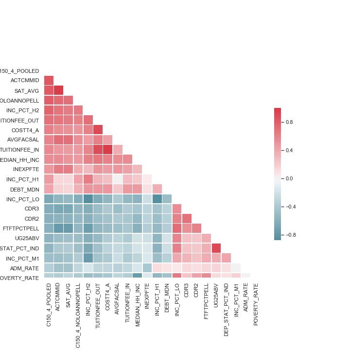
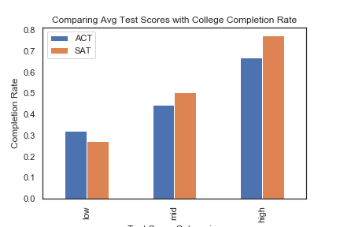
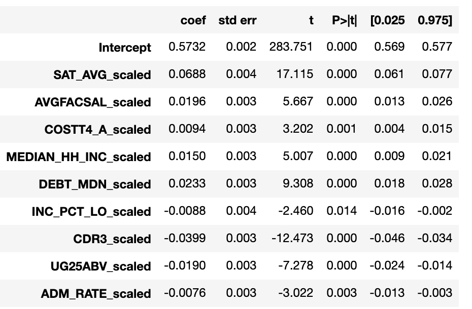

# College Graduation Rates in the US

Flatiron Module 2 Project
Contributors: Lauren Cunningham 

Dataset: US Department of Education's College Scorecard, Most Recent Level-Institutional Data
https://collegescorecard.ed.gov/data/

## Overview 
The objective of this project was to clean, explore and model a dataset of our choosing. I chose to explore what influences College Graduation Rates in the US. Using data from the US Department of Education, I was able to make several hypotheses and ultimately, model my data in a multivariate linear regression model. 

## Data Cleaning & Visualization 
My dataset was quite large (6806 rows, 1986 columns) so first, I scaled it down to only include 4-year predominantly bachelor-degree granting institutions. I then went through the College Scorecard's provided data dictionary, as well as correlation matrices to determine which features I thought had the most influence on graduation rates. Once my dataframe was narrowed down (my_dataframe.csv) I had (2058 rows, 33 columns). 

I converted several of my columns from strings to integers (data_cleaning.ipynb). 

To start my exploratory analysis, I generated a heatmap of the top highly correlated variables in my dataframe. 

I was interested in seeing how SAT/ACT scores influenced graduation rates so I made 2 scatterplots and a grouped bar chart to display their positive relationship with graduation rates. 

## Hypothesis Testing 

##### ANOVA Test for ACT/SAT Categories
H0: there is no significant difference in grad rates for low, mid & high scoring schools

Ha: there is a significant difference in grad rates for low, mid & high scoring schools 

ACT p-val = 4.8244965122291765e-158
SAT p-val = 4.729311532101925e-239

We reject the null: at least one testing category is significantly different in terms of their mean grad rate

##### ANOVA Test for Instructional Expenditure Categories
H0: there is no significant difference in mean graduation rates for low, mid and high instructional expenditure groups

HA: there is a significant difference in mean graduation rates for low, mid and high groups

p-val = 2.095381989499582e-150

We reject the null: at least one spending category is significantly different in terms of their mean grad rate

#####  ANOVA Test for Median Household Income Categories
H0: there is no significant difference in mean graduation rates for low, mid and high median household incomes

HA: there is a significant difference in mean graduation rates for low, mid and high groups

p-val = 1.0872990430128435e-146

We reject the null: at least one median income category is significantly different in terms of their mean grad rate

## Modeling 
I tested 4 models with my features: 2-degree polynomial, 3-degree polynomial, Lasso and Multivariable Linear Regression.

My best fit model was my MLR model. 

Multivariable Linear Regression Model
1. Remove features that are collinear 
2. Scale my data
3. Train-test split 
4. Evaluate model 

R^2 = 0.833

Train RMSE: 0.07037445611566073

Test RMSE: 0.0683328651860831

## Conclusions 
- A college’s average test scores and their graduation rate are highly correlated
- We can also see this in the MLR model; SAT avg has the highest coefficient
- Faculty salary, cost of attendance, household income are all positively correlated with graduation rates 
- Default rates, percent of low income students, age and admission rate are negatively correlated

Limitations:
- Some schools don’t report on all the features I was including so I had to drop those 
- There was a lot of multicollinearity in the features I chose
- The features that I was left with are pretty specific and it might be hard to get this data for all institutions to predict graduation rates 

